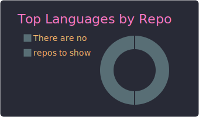
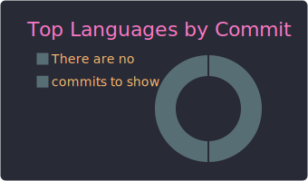
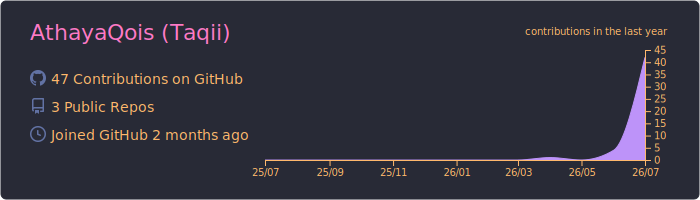
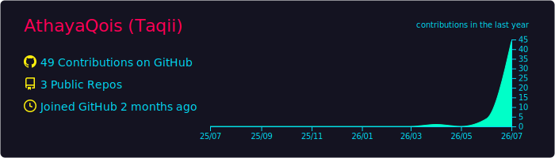
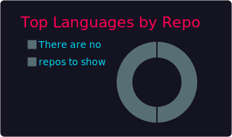
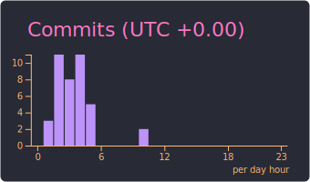

# Athaya-Qois
# Hi there, I'm Athaya 👋 🚀 Software Engineering Student | Web &amp; Logic Developer  Halo! Saya adalah seorang siswa SMK jurusan Rekayasa Perangkat Lunak (RPL) yang fokus pada pengembangan web, logika pemrograman, dan pembuatan sistem yang efisien.

  
  

  
  

## 📊 Statistics

  

  

### 📊 GitHub Profile Summary Cards

  

  
  

  
  

